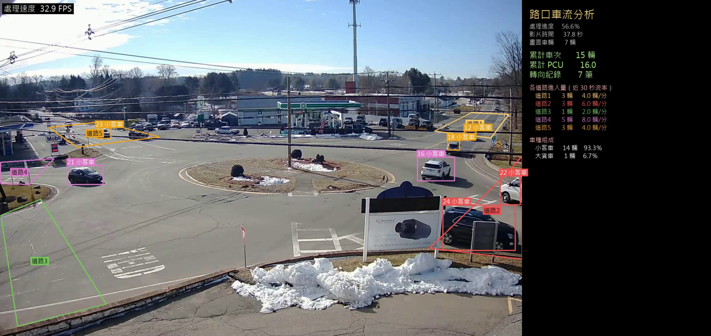
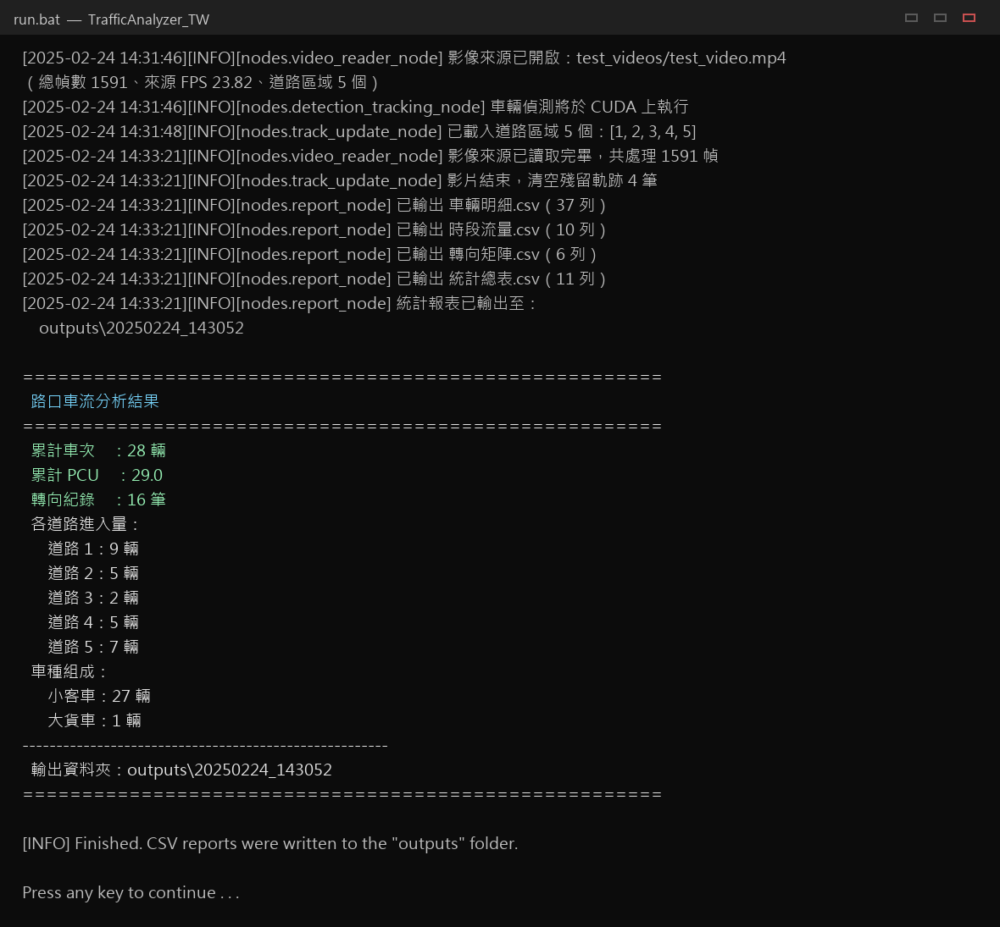

# 路口車流分析系統 TrafficAnalyzer_TW

以電腦視覺自動化產出路口／圓環的車流調查數據，取代人工計數。

輸入一段路口影片，輸出各方向進入流量、車種組成、轉向 OD 矩陣、時段流量報表與標註影片。

```
┌──────────────┐     ┌────────────────────────┐     ┌──────────────┐
│              │     │                        │     │              │
│  路口影片     │     │   YOLO 偵測            │     │  CSV 統計報表 │
│  攝影機       │ ──→ │   ByteTrack 追蹤       │ ──→ │  標註成果影片 │
│  RTSP 串流    │     │   區域判定 + 精確計數   │     │  即時預覽畫面 │
│              │     │                        │     │              │
└──────────────┘     └────────────────────────┘     └──────────────┘
```

---

## 目錄

1. [快速開始](#快速開始)
2. [執行畫面](#執行畫面)
3. [它在做什麼：圖解](#它在做什麼圖解)
4. [輸出的報表](#輸出的報表)
5. [相依套件版本說明（重要）](#相依套件版本說明重要)
6. [換成自己的影片](#換成自己的影片)
7. [常用參數](#常用參數)
8. [疑難排解](#疑難排解)
9. [已知限制](#已知限制)
10. [素材來源與致謝](#素材來源與致謝)

---

## 快速開始

### 環境需求

| 項目 | 需求 |
|------|------|
| 作業系統 | Windows 10 / 11 |
| Python | 3.10（透過 conda 建立） |
| 顯示卡 | NVIDIA GPU（建議）。無 GPU 會自動改用 CPU，但速度大幅下降 |
| 硬碟空間 | 約 2 GB（含權重與測試影片） |

### 安裝

```
步驟 1               步驟 2               步驟 3               步驟 4
┌──────────┐       ┌──────────┐       ┌──────────┐       ┌──────────┐
│ 建立環境  │  ──→  │ 裝 PyTorch│  ──→  │ 裝其餘套件│  ──→  │ 雙擊執行  │
│          │       │          │       │          │       │          │
│ 約 1 分鐘 │       │ 約 2.4 GB │       │ 約 1 分鐘 │       │ 完成     │
└──────────┘       └──────────┘       └──────────┘       └──────────┘
```

```bash
# 步驟 1：建立 Python 3.10 虛擬環境
conda create --name traffic python=3.10 -y
conda activate traffic

# 步驟 2：安裝 PyTorch（CUDA 12.1 版，約 2.4 GB）
pip install torch==2.3.1 torchvision==0.18.1 --index-url https://download.pytorch.org/whl/cu121

# 步驟 3：安裝其餘套件
pip install -r requirements.txt
```

### 取得影片與權重（首次使用必讀）

為了尊重原素材的授權並控制儲存庫體積，**這兩樣東西沒有放進 repo**，需要自行準備：

```
  ┌─ test_videos/test_video.mp4 ─────────────────────────────────┐
  │                                                              │
  │  示範影片屬於原開源專案，本專案不轉散布。兩種取得方式：          │
  │                                                              │
  │   A. 從原專案下載同一支示範影片                                │
  │      https://github.com/Koldim2001/TrafficAnalyzer           │
  │      放到 test_videos\ 即可直接執行                            │
  │                                                              │
  │   B. 用你自己的路口影片                                        │
  │      放到 test_videos\，然後：                                 │
  │        run.bat video_reader.src=test_videos/你的檔名.mp4      │
  │      ⚠ 必須同時重畫 configs\roads_polygons.json 的區域座標     │
  │        （見「換成自己的影片」章節）                             │
  └──────────────────────────────────────────────────────────────┘

  ┌─ weights/yolov8m.pt ─────────────────────────────────────────┐
  │                                                              │
  │  首次執行時 Ultralytics 會自動下載（約 52 MB），不需手動處理。   │
  │  若下載失敗（公司／學校網路常見），手動從下列位置取得後           │
  │  放進 weights\ 資料夾即可：                                    │
  │      https://github.com/ultralytics/assets/releases          │
  └──────────────────────────────────────────────────────────────┘
```

### 執行

| 做法 | 說明 |
|------|------|
| 雙擊 **`START.bat`** | **建議從這裡開始。** 會先檢查影片與權重是否齊全，缺什麼就告訴你，齊了才啟動 |
| 雙擊 **`run.bat`** | 直接啟動即時預覽視窗。按 `Q` 或 `Esc` 可提前結束，仍會輸出報表 |
| 雙擊 **`run_export.bat`** | 無視窗，輸出成果影片 + 報表。批次處理用，速度最快 |
| `python main.py` | 同 `run.bat`，但需先手動 `conda activate traffic` |

執行結束後，結果會在 `outputs\<年月日_時分秒>\` 資料夾裡。

---

## 執行畫面

### 即時預覽視窗

雙擊 `run.bat` 後會跳出這個視窗。左側是影片畫面與疊加圖層，右側是即時統計面板：



畫面元素對照：

| 元素 | 意義 |
|------|------|
| 彩色多邊形 | 五條聯絡道的偵測區域，標註「道路1」～「道路5」 |
| 車輛邊界框 | 顏色代表**這台車從哪一條路進來**，尚未判定時為灰色 |
| 框上文字 | 追蹤編號 + 中文車種，例如「26 小客車」 |
| 左上角 | 即時處理速度（FPS） |
| 右側面板 | 處理進度、累計車次、PCU、轉向筆數、各道路流量、車種組成 |

### 主控台輸出

執行過程會逐步回報各節點狀態，結束時印出統計摘要與報表位置：



這段輸出可以當成快速檢核：

```
  累計車次 28 輛  ←→  車輛明細.csv 裡「是否計入統計 = 是」的列數
  轉向紀錄 16 筆  ←→  轉向矩陣.csv 右下角的合計值
  各道路進入量    ←→  統計總表.csv 的「車次合計」欄
```

三處數字對不起來就代表有問題。實測這三份報表皆由同一份原始紀錄推導，必定一致。

---

## 它在做什麼：圖解

### 一、處理流水線

每一幀影像依序流過七個節點，每個節點只做一件事，並把自己的產出掛到同一個資料物件上：

```
   影片
    │
    ▼
┌─────────────────────┐
│ ① 影像讀取           │  取出一幀 + 時間戳 + 道路區域座標
└─────────┬───────────┘
          ▼
┌─────────────────────┐
│ ② 偵測 + 追蹤        │  YOLO 找出車輛 → ByteTrack 給每台車固定編號
└─────────┬───────────┘
          ▼
┌─────────────────────┐
│ ③ 軌跡維護           │  判斷每台車踩到哪個區域、累積車種投票
└─────────┬───────────┘
          ▼
┌─────────────────────┐
│ ④ 車流計數           │  ★ 精確累計 + 轉向 OD（每台車只計一次）
└─────────┬───────────┘
          ▼
┌─────────────────────┐
│ ⑤ 畫面繪製           │  疊加區域、邊界框、統計面板
└─────────┬───────────┘
          ▼
┌──────────┐  ┌──────────┐
│ ⑥ 影片輸出│  │ ⑦ 報表輸出│
└──────────┘  └──────────┘
```

### 二、怎麼判斷「從哪裡來、到哪裡去」

圓環的每一條聯絡道上，都預先畫了一個偵測區域（多邊形）：

```
                      ┌──────────┐
                      │  道路5   │
                      └────┬─────┘
                           │
                           │
      ┌──────────┐    ╭────┴─────╮    ┌──────────┐
      │  道路4   │────┤   圓環   ├────│  道路1   │
      └──────────┘    ╰────┬─────╯    └──────────┘
                           │
                 ┌─────────┴────────┐
                 │                  │
           ┌──────────┐      ┌──────────┐
           │  道路3   │      │  道路2   │
           └──────────┘      └──────────┘
```

系統追蹤每台車的中心點，記錄它踩過哪些區域：

```
  車輛 #12 的完整歷程
  ═══════════════════

   第 1 個踩到的區域            第 1 個「不同的」區域
          │                            │
          ▼                            ▼
      ┌───────┐                    ┌───────┐
      │ 道路5 │ ──→  圓環繞行  ──→ │ 道路1 │
      └───────┘   （不屬任何區域）  └───────┘
          │                            │
      進入道路                      離開道路
          │                            │
          └──────→ OD(5 → 1) ←─────────┘
                        │
                        ▼
                 轉向矩陣 +1
```

### 三、一台車什麼時候才算數

不是看到就算。要通過三道門檻，而且**每台車最多只被計一次**：

```
  偵測到一台車
       │
       ▼
  ┌─────────────────────────┐
  │ 有踩到任何區域嗎？        │──否──→ ✗ 不計入
  └───────────┬─────────────┘         （停在圓環中央的車、路邊停車）
              │ 是
              ▼
  ┌─────────────────────────┐
  │ 存活時間 ≥ 1.5 秒？      │──否──→ ✗ 不計入
  └───────────┬─────────────┘         （一閃而過的誤偵測）
              │ 是
              ▼
  ┌─────────────────────────┐
  │ 成功辨識 ≥ 5 幀？        │──否──→ ✗ 不計入
  └───────────┬─────────────┘         （破碎軌跡）
              │ 是
              ▼
        ✓ 計入「進入流量」
          （此車永不再計第二次）
              │
              ▼
  ┌─────────────────────────┐
  │ 後來踩到不同的區域？      │──是──→ ✓ 再計入「轉向 OD 矩陣」
  └─────────────────────────┘

  實測：測試影片 37 條軌跡中，28 條通過門檻、9 條被濾除。
```

### 四、車種是怎麼來的（本專案的關鍵改良）

多目標追蹤演算法為了避免配對錯誤，送進去之前會把所有物件的類別統一。
代價是**追蹤結果完全沒有車種資訊**：

```
   YOLO 偵測          送進追蹤器           追蹤器輸出
  ┌──────────┐      ┌────────────┐      ┌──────────┐
  │  機車     │      │  類別全部   │      │   car    │ ← 車種不見了
  │  小客車   │ ───→ │  統一改成   │ ───→ │   car    │
  │  大貨車   │      │    car     │      │   car    │
  └──────────┘      └────────────┘      └──────────┘
```

本專案的作法：**不動追蹤邏輯**，追蹤完之後再把框「對回」原始偵測框，
並用整段生命週期的多數決決定車種：

```
  追蹤編號 #7 的車種投票過程
  ═══════════════════════════

   幀次    追蹤框 ∩ 偵測框       IoU     投票
  ──────  ────────────────────  ─────   ──────────
   101     ↔ 偵測框「機車」      0.88     機車
   102     ↔ 偵測框「機車」      0.91     機車
   103     被公車遮住，無偵測框   0.02     （不投票）
   104     ↔ 偵測框「其他」      0.76     其他車種
   105     ↔ 偵測框「機車」      0.85     機車
                                        ──────────
                              多數決結果：機車（4 票中 3 票）
```

第 103 幀的狀況說明了為什麼需要多數決：物件被遮擋時，追蹤器會用卡爾曼濾波
「預測」位置，那一幀根本沒有對應的偵測框，若逐幀採用分類結果就會出錯。

### 五、預覽畫面長什麼樣

```
┌──────────────────────────────────────┬────────────────────────┐
│ 處理速度 32.8 FPS                     │  路口車流分析           │
│                                      │                        │
│                                      │  處理進度     56.6％    │
│    ┌─────────┐      ┌─────────┐      │  影片時間     37.8 秒   │
│    │ 道路5   │      │18 小客車 │      │  畫面車輛        7 輛   │
│    └─────────┘      └─────────┘      │                        │
│                                      │  累計車次       15 輛   │
│              ╭────────╮              │  累計 PCU       16.0    │
│              │  圓環  │              │  轉向紀錄        7 筆   │
│              ╰────────╯              │                        │
│    ┌─────────┐      ┌─────────┐      │  各道路進入量           │
│    │ 道路3   │      │ 道路2   │      │   道路1  3 輛  4.0/分   │
│    └─────────┘      └─────────┘      │   道路2  3 輛  6.0/分   │
│                                      │                        │
│  邊界框顏色 = 這台車從哪條路進來        │  車種組成               │
│  框上文字   = 追蹤編號 + 中文車種       │   小客車 14 輛  93.3％  │
│                                      │   大貨車  1 輛   6.7％  │
└──────────────────────────────────────┴────────────────────────┘
          影片畫面（1436 px）                統計面板（520 px）
```

---

## 輸出的報表

每次執行會建立一個獨立資料夾，不會覆蓋先前的結果：

```
outputs/
└── 20250224_143052/              ← 以執行時間命名
    ├── 分析結果.mp4               疊加圖層的成果影片
    ├── 車輛明細.csv               每台車一列  ★ 驗證用，最重要
    ├── 時段流量.csv               時間 × 道路 × 車種
    ├── 轉向矩陣.csv               進入道路 × 離開道路
    └── 統計總表.csv               全時段彙總  ★ 主要成果表
```

四份報表的關係——**全部都由同一份原始紀錄推導而來**，所以數字一定對得起來：

```
                   車輛明細.csv
                 （逐台車的原始事實）
                          │
          ┌───────────────┼───────────────┐
          │               │               │
     按時間切          按流向切          全部加總
          │               │               │
          ▼               ▼               ▼
    時段流量.csv     轉向矩陣.csv     統計總表.csv
```

### 報表範例

**轉向矩陣.csv**

```
進入道路＼離開道路, 往道路1, 往道路2, 往道路3, 往道路4, 往道路5, 合計
道路1,                  0,      0,      0,      4,      1,    5
道路2,                  0,      0,      0,      0,      3,    3
道路3,                  2,      0,      0,      0,      0,    2
道路4,                  3,      0,      0,      0,      0,    3
道路5,                  2,      1,      0,      0,      0,    3
合計,                   7,      1,      0,      4,      4,   16
```

**統計總表.csv**

```
道路,      小客車, 機車, 大客車, 大貨車, 車次合計, PCU合計, 平均流率_輛每小時
道路1,          9,    0,      0,      0,        9,     9.0,            485.4
道路2,          5,    0,      0,      0,        5,     5.0,            269.7
道路3,          1,    0,      0,      1,        2,     3.0,            107.9
道路4,          5,    0,      0,      0,        5,     5.0,            269.7
道路5,          7,    0,      0,      0,        7,     7.0,            377.6
全部合計,      27,    0,      0,      1,       28,    29.0,           1510.3
```

所有 CSV 皆為 **UTF-8 with BOM** 編碼，Windows 的 Excel 直接雙擊開啟即可，中文不會變亂碼。

---

## 相依套件版本說明（重要）

> **使用前請先更新套件至最新版**，否則可能無法正常啟動。
> 依「安裝」章節執行 `pip install -r requirements.txt` 即可，pip 會自動處理版本。

核心套件已於 `requirements.txt` 鎖定版本，其餘間接相依維持最新版即可：

```
┌────────────────────────────────────────────────────────────────┐
│  核心套件 ── 鎖定版本，動了會壞                                   │
│                                                                │
│    torch           2.3.1+cu121  ─┐                             │
│    torchvision     0.18.1+cu121  │  三者版本互相綁定             │
│    ultralytics     8.2.38       ─┘                             │
│                                                                │
│    numpy           1.26.4   ← 必須 < 2.0                       │
│    opencv-python   4.9.0.80                                    │
│    shapely         2.0.3                                       │
│    hydra-core      1.3.2                                       │
├────────────────────────────────────────────────────────────────┤
│  間接相依 ── 已更新至當前版本，維持新版即可                        │
│                                                                │
│    pillow 12.3.0     pandas 2.3.3      matplotlib 3.10.9       │
│    scipy 1.15.3      lapx 0.10.0       python-dotenv 1.2.3     │
│    certifi 2026.7.22                   （以及其他約 20 個）      │
└────────────────────────────────────────────────────────────────┘
```

### 與原專案的相依差異

原開源專案的相依清單在 Windows 無法完整安裝，本專案做了以下替換：

| 原始相依 | 本專案的處理 | 說明 |
|---|---|---|
| `tensorrt 10.1.0` | 移除 | 選配加速套件，不裝仍有約 32 FPS |
| `lap 0.4.0` | 改用 `lapx` | 模組名同為 `lap`，程式無須修改 |
| `cython-bbox 0.1.5` | 改用內附的 `cython_bbox.py` | 純 NumPy 相容層，計算結果與原始完全一致 |

### 驗證環境是否正確

```bash
conda activate traffic
python -c "import torch; print('CUDA:', torch.cuda.is_available(), '|', torch.cuda.get_device_name(0))"
```

正常會輸出類似：

```
CUDA: True | NVIDIA GeForce RTX 4070
```

若顯示 `CUDA: False`，程式仍可執行但會改用 CPU，速度約慢 10 倍以上。

---

## 換成自己的影片

```
  ┌────────────────────────────────────────────────────────────┐
  │  ⚠ 重要：換影片一定要重畫區域座標，否則計數結果完全無意義      │
  └────────────────────────────────────────────────────────────┘
```

目前 `configs\roads_polygons.json` 裡的座標，**只適用於內附的測試影片**。

步驟：

1. 把影片放進 `test_videos\`，或用參數指定路徑
2. 重新繪製 `configs\roads_polygons.json`：每條道路一個多邊形，格式為扁平座標陣列
   ```json
   {
     "1": [x1, y1, x2, y2, x3, y3, x4, y4],
     "2": [x1, y1, x2, y2, x3, y3, x4, y4]
   }
   ```
   座標為像素值，原點在畫面左上角。目前需要手動填寫
   （圖形化的區域編輯工具已列入待開發）
3. 依道路數量調整 `configs\app_config.yaml` 的 `general.colors_of_roads`
4. 視拍攝高度與車輛大小，調整 `detection_node.confidence` 與 `general.min_track_life_secs`

```bash
python main.py video_reader.src=D:/我的路口影片.mp4
```

---

## 常用參數

所有參數集中於 `configs\app_config.yaml`，也可在執行時用命令列覆寫：

```bash
python main.py video_reader.src=D:/我的影片.mp4      # 指定其他影片
python main.py pipeline.save_video=true             # 同時輸出成果影片
python main.py pipeline.show_window=false           # 關閉預覽視窗（加速）
python main.py report_node.interval_seconds=900     # 改用 15 分鐘統計區間
python main.py detection_node.confidence=0.25       # 提高偵測門檻
python main.py general.min_track_life_secs=3.0      # 提高計數門檻
python main.py hydra.job_logging.root.level=DEBUG   # 觀察各節點耗時
```

也可以複製 `.env.example` 為 `.env`，用環境變數指定影片來源、權重路徑、輸出目錄與字型。

### 效能參考（RTX 4070 12GB、1436×926 影片）

| 模式 | 速度 |
|------|------|
| 僅統計（`show_window=false`、`save_video=false`） | 約 80 FPS |
| 繪圖 + 影片輸出 | 約 32 FPS |

---

## 疑難排解

| 症狀 | 原因與處理 |
|------|-----------|
| 雙擊 `run.bat` 視窗一閃就關 | 從命令提示字元執行 `run.bat` 以保留錯誤訊息。最常見原因是 conda 環境 `traffic` 不存在，請依「安裝」章節重建 |
| `_ARRAY_API not found` / NumPy 1.x 相關錯誤 | numpy 被升級到 2.x。執行 `pip install numpy==1.26.4` 降回 |
| `Microsoft Visual C++ 14.0 or greater is required` | 正在嘗試編譯 `lap` 或 `cython-bbox`。請確認用的是本專案的 `requirements.txt`（已改用 `lapx`，且不含 `cython-bbox`） |
| 畫面中文顯示為方框 | 找不到中文字型。在 `.env` 設定 `TRAFFIC_FONT_PATH` 指向有效的字型檔，例如 `C:/Windows/Fonts/msjh.ttc` |
| `CUDA: False`，速度很慢 | 未安裝 CUDA 版 PyTorch。重新執行安裝步驟 2 的指令 |
| CSV 開啟是亂碼 | 報表為 UTF-8 with BOM，請用 Excel 直接開啟，不要用「匯入文字檔」並指定其他編碼 |
| 計數結果明顯偏少或偏多 | 多半是區域座標沒有對應到目前的影片，請檢查 `configs\roads_polygons.json` |

---

## 已知限制

引用本系統產出的數據前請先讀過：

1. **轉向判定為區域級而非車道級。**
   目前每條聯絡道只有一個多邊形，同時涵蓋進入與離開車道，
   因此「進入／離開」是依造訪順序推論。若需要車道級精度，
   須把每條路拆成獨立的「進入區」與「離開區」兩個多邊形。

2. **轉向筆數必然少於累計車次，兩者不可混用。**
   車輛若在畫面外完成離開，或追蹤中途中斷，就只有進入計數而沒有轉向紀錄。

3. **模型未針對本地場景微調。**
   使用 COCO 預訓練權重。內附測試影片幾乎沒有機車，
   因此車種分類在「密集機車群、互相遮擋」這類台灣常見情境下**尚未經過驗證**，
   正式使用前應以標的路口影像進行微調與準確度驗證。

4. **尚未內建準確度驗證模組。**
   `車輛明細.csv` 已提供逐筆資料以支援人工核對，但誤差率計算尚未自動化。

---

## 素材來源與致謝

### 測試影片

`test_videos\test_video.mp4` 引用自開源專案
**[Koldim2001/TrafficAnalyzer](https://github.com/Koldim2001/TrafficAnalyzer)**
所附的示範素材，僅作為本系統的功能驗證之用。

影片內容為一處圓環的定點監視器畫面，規格 1436×926、23.82 fps、66.8 秒、共 1591 幀。
畫面為冬季的北美道路場景，車流以小客車與皮卡車為主，**畫面中沒有機車**。

> 因此本專案目前的執行結果，驗證的是「處理流程正確」，
> 而非「在台灣路況下的辨識準確度」。這兩件事請分開看待。

### 參考專案

系統的節點流水線架構參考自 **[Koldim2001/TrafficAnalyzer](https://github.com/Koldim2001/TrafficAnalyzer)**。
本專案在其架構概念之上重新實作，並補上該專案未涵蓋的精確累計計數、
車種分類統計、轉向 OD 矩陣與 CSV 報表輸出等實務分析所需的功能。

原專案的完整副本保留於同層的 `TrafficAnalyzer_ref\` 作為對照基準。

### 第三方元件

| 元件 | 來源 | 用途 |
|------|------|------|
| YOLOv8 | [Ultralytics](https://github.com/ultralytics/ultralytics) | 車輛偵測 |
| ByteTrack | [ifzhang/ByteTrack](https://github.com/ifzhang/ByteTrack) | 多目標追蹤，原樣保存於 `vendor\byte_tracker\` |

---

## 相關文件

| 文件 | 內容 |
|------|------|
| [CLAUDE.md](./CLAUDE.md) | 系統架構、模組職責、關鍵資料流、待開發清單 |
| [CHANGELOG.md](./CHANGELOG.md) | 完整變更歷史 |
| [core/CLAUDE.md](./core/CLAUDE.md) | 資料結構說明 |
| [nodes/CLAUDE.md](./nodes/CLAUDE.md) | 各節點的職責與設計決策 |
| [utils/CLAUDE.md](./utils/CLAUDE.md) | 共用工具說明 |

---

**文檔版本**：v1.0.1
**建立日期**：2025-02-24
**最後更新**：2026-10-03（環境重建，相依套件更新至當前版本）
